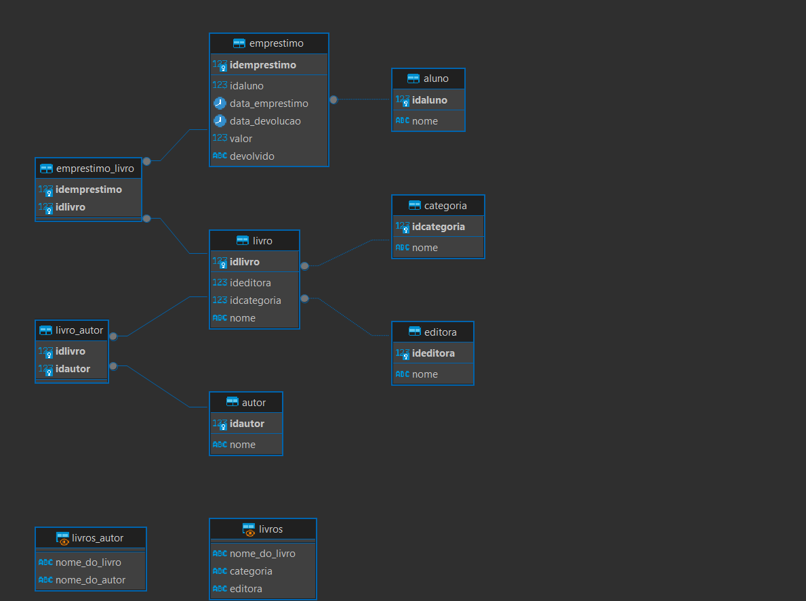

# **Avaliação Pratica de PostgreSQL**

---

## Introdução

Esta avaliação prática foi desenvolvida pelo professor Jones Granatyr para testar e consolidar os conhecimentos adquiridos na disciplina de Banco de Dados em cursos presenciais de Ciência da Computação e Sistemas de Informação e no curso de Banco de Dados e Linguagem SQL com PostgreSQL da plataforma Udemy. O exercício abrange desde a criação de um banco de dados e suas tabelas até a inserção e manipulação de dados, garantindo que os conceitos fundamentais de SQL e PostgreSQL sejam compreendidos e aplicados corretamente.

---

## Estrutura de Pastas

``` bash
.
├── doc/                        # Pasta contendo a avaliação em branco em PDF
├── img/                        # Pasta contendo a imagem e o PDF do diagrama do banco de dados
├── sql/                        # Pasta contendo o script SQL das minhas resposta
└── README.md                   # Este arquivo
```

## Gabarito

---

✅ Correto
❌ Incorreto

- 01: ✅
- 02: ✅
- 03: ✅
- 04: ✅
- 05: ✅
- 06: ✅
- 07: ✅
- 08: ✅
- 09: ✅
- 10: ✅
- 11: ✅
- 12: ✅
- 13: ✅
- 14: ✅
- 15: ✅
- 16: ✅
- 17: ✅
- 18: ✅
- 19: ✅
- 20: ✅
- 21: ✅
- 22: ✅
- 23: ✅
- 24: ✅
- 25: ✅
- 26: ✅
- 27: ✅
- 28: ✅
- 29: ✅
- 30: ✅
- 31: ✅
- 32: ✅
- 33: ✅
- 34: ✅
- 35: ✅
- 36: ✅
- 37: ❌

```sql
SELECT
    DISTINCT(lvr.nome) AS livro
FROM
    emprestimo_livro AS emlv
LEFT OUTER JOIN
    livro AS lvr ON emlv.idlivro = lvr.idlivro;
```

- 38: ✅
- 39: ✅
- 40: ✅
- 41: ❌

```sql
SELECT
    aln.nome AS nome_do_aluno,
    COUNT(ept.idemprestimo) AS quantidade_de_emprestimo
FROM
    emprestimo AS ept
LEFT OUTER JOIN
    aluno AS aln ON aln.idaluno = ept.idaluno
GROUP BY
    aln.nome;
```

- 42: ✅
- 43: ✅
- 44: ✅
- 45: ✅
- 46: ✅
- 47: ✅
- 48: ✅
- 49: ✅
- 50: ✅
- 51: ✅

## Diagrama



## Conclusão

---

Essa avaliação cobre os conceitos essenciais de criação e manipulação de bancos de dados em PostgreSQL, incluindo a definição de chaves primárias e estrangeiras, a inserção de dados e a realização de consultas básicas. Este exercício prático é fundamental para reforçar o entendimento e a aplicação dos conhecimentos adquiridos no curso de Banco de Dados e Linguagem SQL com PostgreSQL.
